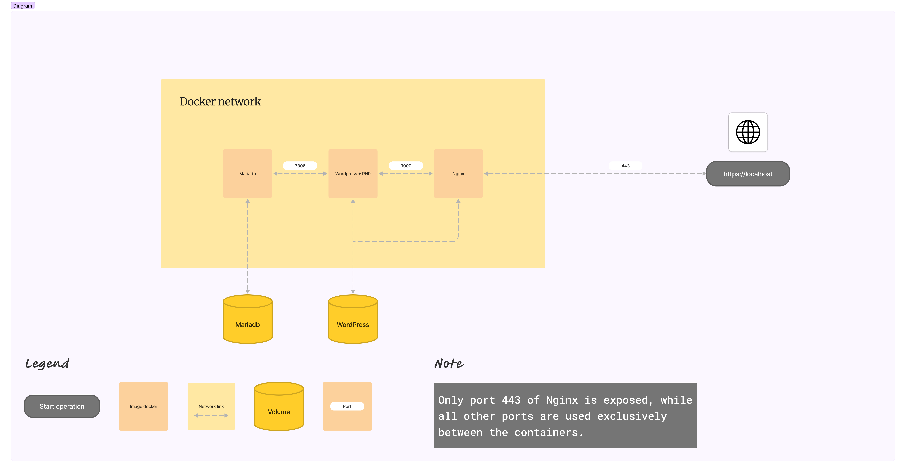
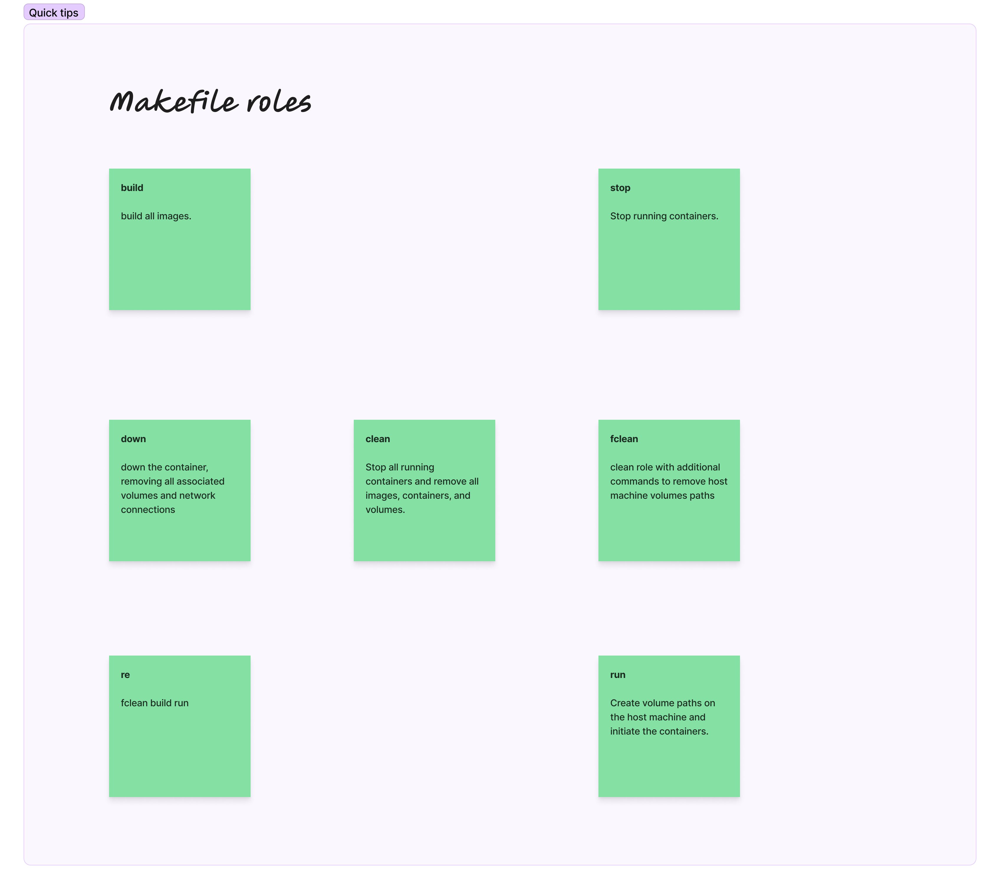

# Intorduction:
This project utilizes Docker to provide a hands-on understanding of its core concepts:  
    - **The fundamentals of Docker operation and commands.** 
    - **How to Configure Nginx as a Reverse Proxy.** 
    - **Configuration of WordPress and Interaction with MariaDB.** 
    - **Creating Your First Custom Docker-Compose File Using YAML.** 

# User story:
As a developer, I want to use Docker Compose for a hassle-free WordPress website deployment. This offers:  
    - **Simplified management: Run MariaDB, Nginx, and WordPress in separate containers.** 
    - **Consistent configuration: Ensures uniformity across environments.** 
    - **Data persistence: Guarantees website data isn't lost with volume allocation.** 
    - **Seamless communication: Leverages Docker's network for smooth interaction between containers.** 

# Project roadmap

# Roles
